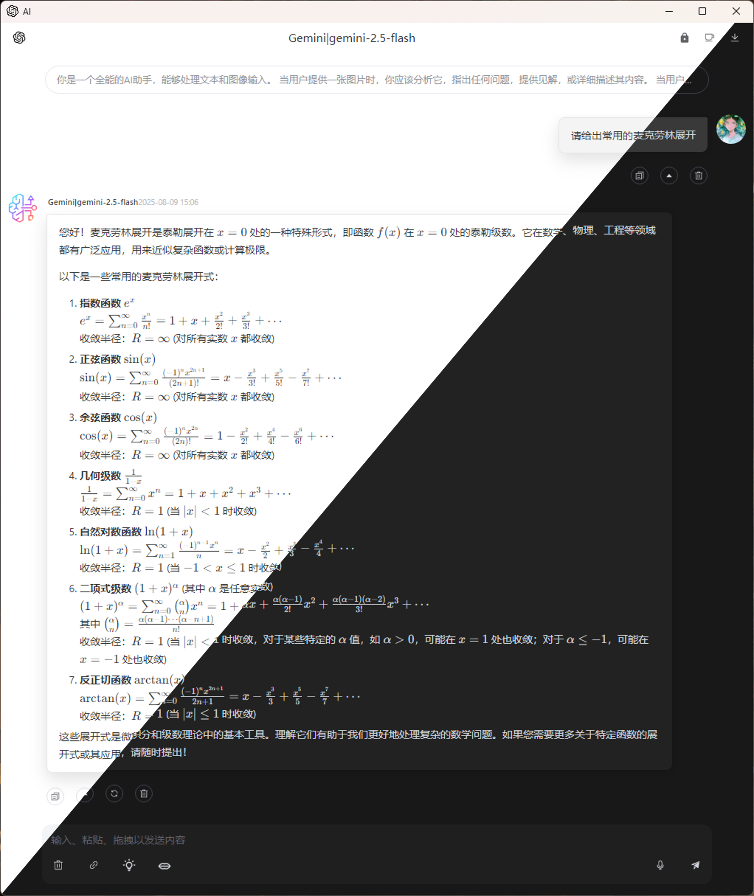
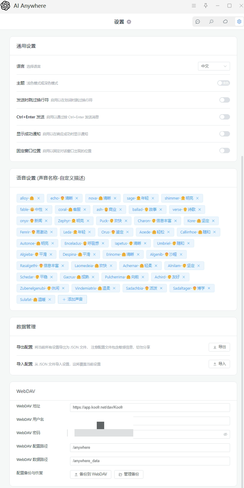

# Anywhere

**您的智能快捷AI助手，随时随地，便捷召唤AI！**

Anywhere 是一款功能强大、高效实用的AI助手，旨在为您提供卓越的AI服务体验。无论是日常学习、工作、创意探索，还是实现划词翻译、变量名命名、OCR、AI高情商回复，甚至AI绘图，它都能成为您的得力助手。

同时，Anywhere 也可作为AI服务商的集成平台，或个人提示词的理想存储与管理工具。

---

## 🚀 快速上手与体验

通过以下方式，您可以立即免费体验Anywhere的强大功能：

1. **AI Studio（Google免费提供Gemini，推荐）**
    *   访问[https://aistudio.google.com/apikey](https://aistudio.google.com/apikey)申请您的API密钥
    *   在Anywhere应用中填入URL，使用gemini官方url`https://generativelanguage.googleapis.com/v1beta/openai`或者使用作者提供的中转接口`https://gemini-oai.001412.xyz/v1`
    *   在Anywhere应用中填入KEY：`您的密钥`
    *   **搜索模式使用**：复制一个存在的模型名称（从API获取模型，选择一个对话模型，如gemini-2.5-flash-preview-05-20），点击手动添加，将模型名称粘贴并增加":search"后缀，例如（gemini-2.5-flash-preview-05-20:search）
    *   **中转平台使用项目**：https://github.com/Komorebi-yaodong/openai-gemini （直接连接仓库，未进行代码更改，可以通过分析仓库代码进行安全分析，**安全提示**：当你使用他人的中转API时，他人有能力更改中转API代码实现读取你使用的密钥的，请鉴别使用）

2.  **OpenRouter（推荐免费体验）**：
    *   访问 [https://openrouter.ai](https://openrouter.ai) 申请您的API密钥。
    *   在Anywhere应用中填入URL：`https://openrouter.ai/api/v1`。
    *   在Anywhere应用中填入KEY：`您的密钥`。

3.  **Pollinations（无需密钥）**：
    *   直接在Anywhere应用中填入URL：`https://text.pollinations.ai/openai`，即可轻松体验OpenAI模型，无需额外配置密钥。

**作者常用提示词库**：
访问 `https://komorebi.001412.xyz` 获取并使用作者常用的提示词库（需网络访问GitHub）。

---

## 💡 核心功能亮点

### 一、便捷智能交互

1.  **一键调用AI**：
    *   选中或复制文本后，在目标输入区域调用快捷方式“Completion”即可快速获取AI回复（类型选择**文本**或**通用**）。
    *   截图后，在目标输入区域调用快捷方式即可快速处理分析图片（类型选择**图片**或**通用**）。
    *   选中或复制文件后，在目标输入区域调用快捷方式即可快速分析文件，窗口模式打开文件不会立即发送，可以在快捷助手中配置。
    *   搭配自定义快捷键，使用体验更佳。
2.  **灵活输出模式**：AI生成结果可直接作为文本输入到当前应用中，或通过独立的窗口模式展示。
3.  **多模态文件支持**：（详细查看第五条）
    *   支持所有文本文件（如txt、markdown、json等）及docx文档上传。
    *   支持图片、音频、PDF文件上传（请确保所选模型支持多模态输入，否则可能报错）。
4.  **智能文本处理**：支持划词时自动跳过输入文本中的换行符，提升输入效率。
5.  **便捷保存/加载对话**：支持保存对话内容，方便您随时继续之前的对话。

### 二、沉浸式对话与显示

1.  **多轮对话追问**：窗口模式支持持续的对话交流，您可直接输入文字、粘贴图片或拖拽上传文件。通过 `Ctrl+Enter` 或 `Enter` 发送信息。
2.  **丰富内容渲染**：支持Markdown渲染，包括公式、代码高亮、图片重加载及Mermaid图表，让AI回复更美观、易读。
3.  **舒适视觉体验**：支持暗色主题，为您提供更舒适的阅读与操作环境。
4.  **无记忆对话**：支持启动无记忆对话功能，适用于需要全新上下文或保护隐私的场景。

### 三、高度自定义与管理

1.  **自定义API与模型**：
    *   支持配置兼容OpenAI API格式的自定义API地址和模型，满足您的个性化需求。
    *   自定义模型会自动增加后缀，删除模型时可无需填写后缀。
2.  **个性化提示词**：支持自定义提示词，并可根据发送内容类型（文字专注“text”、图片专注“image”、通用“general”）选择不同的提交方式。
3.  **多密钥轮询**：支持设置多个API密钥（英文逗号分隔），Anywhere将自动轮询调用，提高请求的稳定性和可用性。
4.  **数据导入导出**：支持用户数据的导出与导入，方便您进行数据备份与迁移。
5.  **自定义UI外观**：支持自定义快捷助手图标及快捷助手分类标签，打造专属的操作界面。
6.  **对话导出与加载**：支持对话内容的导出与加载，方便您保存和分享对话记录（用窗口模式加载对话文件即可进入保存的对话，注意继续对话不会更改已保存的对话）。

### 四、个性化窗口设置

1.  **默认窗口大小调整**：在窗口模式下，点击模型名称左侧图标即可更新当前默认窗口大小。
2.  **固定窗口位置**：启用设置页面的“固定窗口位置”功能后，点击模型名称左侧图标可更新默认窗口的出现位置（否则将默认出现在鼠标所在位置）。
3.  **智能窗口消失**：
    *   可在设置页面全局配置“窗口失去焦点后自动消失”功能。
    *   打开的对话窗口在右上角也可以单独设置当前窗口是否“失去焦点自动消失”，灵活控制，防止页面意外消失。
4.  **分离独立窗口**：支持将对话窗口自动分离为独立窗口，方便多任务处理。

### **五、支持的文件类型**

1. 窗口模式下可以使用的文件类型：
    1. 可以**自动解析为文本**的文件：'.txt', '.md', '.markdown', '.json', '.xml', '.html', '.css', '.csv', '.py', '.js', '.ts', '.java', '.c', '.cpp', '.h', '.hpp', '.cs', '.go', '.php', '.rb', '.rs', '.sh', '.sql', '.vue', **'.docx'**
    2. 需要**模型支持**的文件：
        - 图片文件：'.png', '.jpg', '.jpeg', '.webp'
        - 音频文件：'.mp3', '.wav'
        - 文档文件：'.pdf'
2. 其它模式下可以使用的文件类型：
    1. 可以**自动解析为文本**的文件：'.txt', '.md', '.markdown', '.json', '.xml', '.html', '.css', '.csv', '.py', '.js', '.ts', '.java', '.c', '.cpp', '.h', '.hpp', '.cs', '.go', '.php', '.rb', '.rs', '.sh', '.sql', '.vue'
    2. 需要**模型支持**的文件：
        - 图片文件：'.png', '.jpg', '.jpeg', '.webp'
        - 音频文件：'.mp3', '.wav'
        - 文档文件：'.pdf'

---

## ⚠️ 注意事项

1.  **虚拟机兼容性**：Anywhere使用utools内置API实现模拟输入，可能对虚拟机环境兼容性不佳，自动输入可能导致文本重复，请避免在虚拟机中使用。
2.  **Markdown输出冲突**：由于AI自动回复默认是Markdown格式，且大多Markdown软件会自动补全用户格式（例如列表尾部换行后自动增加序号，而AI的回复并不会注意到这一点）。在选择“input”输出模式时，这可能产生冲突，建议使用Markdown的源码模式来避免。
3.  **独立窗口与设置**：当开启“自动分离为独立窗口”功能时，文本生成期间设置界面可能无法关闭。
4.  **文件上传报错**：上传的模型不支持的文件类型可能会导致AI处理报错，请确保选择的模型与文件类型兼容。

---

## ✨ 页面展示

---

## 📖 详细教程

获取更详细的功能介绍、配置步骤和使用技巧，请访问：
[Anywhere 教程](https://github.com/Komorebi-yaodong/Anywhere/blob/main/Tutorial.md)
