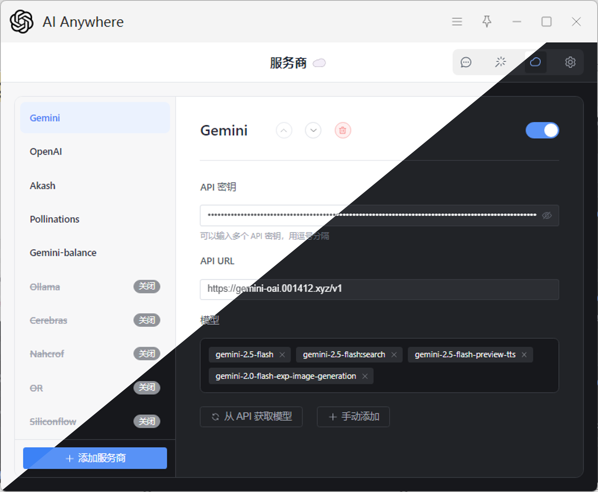

# Anywhere

**你的智能快捷AI助手，随时随地，便捷召唤AI！**

Anywhere，一款功能强大、高效实用的AI助手，旨在为你提供卓越的AI服务体验。无论是日常学习、工作、创意探索，还是实现划词翻译、变量名命名、OCR、文件总结、音频转录，甚至AI绘图，它都能成为你的得力助手。

同时，Anywhere 也可作为AI服务商的集成平台，或个人提示词的理想存储与管理工具。

---

## 🚀 快速上手与体验

通过以下方式，你可以立即免费体验Anywhere的强大功能：

1. **AI Studio（Google免费提供Gemini，推荐）**

   * 访问[https://aistudio.google.com/apikey](https://aistudio.google.com/apikey)申请你的API密钥
   * 在Anywhere应用中填入URL，使用gemini官方url `https://generativelanguage.googleapis.com/v1beta/openai`或者使用作者提供的中转接口 `https://gemini-oai.001412.xyz/v1`
   * 在Anywhere应用中填入KEY：`你的密钥`
   * **搜索模式使用**：复制一个存在的模型名称（从API获取模型，选择一个对话模型，如gemini-2.5-flash），点击手动添加，将模型名称粘贴并增加":search"后缀，例如（gemini-2.5-flash:search）
   * **中转平台使用项目**：https://github.com/Komorebi-yaodong/openai-gemini （直接连接仓库，未进行代码更改，可以通过分析仓库代码进行安全分析，**安全提示**：当你使用他人的中转API时，他人有能力更改中转API代码实现读取你使用的密钥的，请鉴别使用），中转平台支持 `gemini-2.5-flash-preview-tts`的语音输出模型（使用方法同 `gpt-4o-audio-preview`，也同 `tts-1`两种调用方式，查看openAI官方文档）
2. **OpenAI（需申请密钥，免费账号可以使用免费模型）**：

   * 访问[https://platform.openai.com/api-keys](https://platform.openai.com/api-keys)申请你的API密钥。
   * 在Anywhere应用中填入URL：`https://api.openai.com/v1`。
   * 在Anywhere应用中填入KEY：`你的密钥`。
   * 免费使用 `gpt-4.1-mini`、`gpt-4.1-nano`、`gpt-4o-mini`（支持读取PDF！）
3. **OpenRouter（推荐免费体验）**：

   * 访问[https://openrouter.ai](https://openrouter.ai)申请你的API密钥。
   * 在Anywhere应用中填入URL：`https://openrouter.ai/api/v1`。
   * 在Anywhere应用中填入KEY：`你的密钥`。
4. **Pollinations（无需密钥）**：

   * 直接在Anywhere应用中填入URL：`https://text.pollinations.ai/openai`，即可轻松体验OpenAI模型，无需额外配置密钥
   * 在 `https://auth.pollinations.ai`页面获取token（即密钥），或者忽视这一步
   * 免费试用 `gpt-4.1`、`o3`、`deepseek-r1-0528`、`openai-audio`、`grok-3-mini`
   * `openai-audio`支持语音回复，选择OpenAI支持的声音即可语音聊天

**作者常用提示词库**：
访问 `https://komorebi.001412.xyz`获取并使用作者常用的提示词库（需网络访问GitHub）。

---

## 💡 核心功能亮点

### 一、便捷智能交互

1. **一键调用AI**：
   * 设置AI快捷助手后，可以点击快捷助手对应的功能指令，即可打开对话页面（要求显示模式为**窗口模式**才能够拥有功能指令，否则只能拥有匹配指令）。
   * 输入AI快捷助手名称/或者名称中的一部分，打开对话页面（类型选择**文本**或**通用**，显示模式选择**窗口模式**）。
   * 选中或复制文本后，在目标输入区域调用快捷方式，即可快速获取AI回复（类型选择**文本**或**通用**）。
   * 截图后，在目标输入区域调用快捷方式即可快速处理分析图片（类型选择**截图**或**通用**）。
   * 选中或复制文件后，在目标输入区域调用快捷方式即可快速分析文件，窗口模式打开文件不会立即发送，可以在快捷助手中配置是否直接发送。
   * 搭配自定义快捷键，使用体验更佳(目标指令直接填写**快捷助手名称**即可，插件页面有**功能指令**和**匹配指令**两者，都可以配置快捷键哦)。
2. **多模态与语音交互**：
   * **语音输入**：在对话窗口中，点击麦克风按钮即可开始录音，实现直接输入音频，沟通更自然（需要模型支持，例如 `gemini-2.5-flash-preview-tts`、 `gpt-4o-audio-preview`、`openai-audio`）。
   * **语音输出**：为快捷助手配置默认声音角色后，AI的回复将以语音形式播放，并支持在对话界面中暂停、重播（需要模型支持，例如 `gemini-2.5-flash-preview-tts`、`gpt-4o-audio-preview`、`openai-audio`）。
3. **灵活输出模式**：AI生成结果可直接作为文本输入到当前应用中，或者输入到剪贴板中方便一键粘贴AI回复，或通过独立的窗口模式展示。
4. **智能文本处理**：支持划词时自动跳过输入文本中的换行符，提升输入效率。
5. **便捷保存/加载对话**：支持保存对话内容，方便你随时继续之前的对话，**加载对话文件时，将使用原文件名作为默认保存名称**。
6. **全新输入框体验**：对话窗口输入框采用全新设计，支持水平与垂直两种布局，可在设置中切换，**重新聚焦窗口时，输入框会自动激活，无缝衔接你的思路**。

### 二、沉浸式对话与显示

1. **多轮对话追问**：窗口模式支持持续的对话交流，你可直接输入文字、粘贴图片或拖拽上传文件。通过 **`Enter` 或 `Ctrl+Enter`（可在设置中切换）**发送信息。
2. **丰富内容渲染**：
   * 支持Markdown渲染，包括公式、代码高亮、图片重加载。
   * **代码块优化**，支持在代码块的顶部和底部一键复制代码，操作更便捷。
   * **对话中会清晰展示AI模型名称、声音角色（若启用）以及消息时间戳**。
3. **舒适视觉体验**：**支持全局浅色/暗色主题切换**，为你提供更舒适的阅读与操作环境。
4. **无记忆对话**：支持启动无记忆对话功能，适用于无上下文记忆的场景（如OCR、翻译等）。
5. **对话折叠**：支持折叠/展开单个对话气泡，或通过点击头像批量折叠/展开同一角色的所有对话，方便快速浏览上下文。

### 三、高度自定义与管理

1. **自定义API与模型**：
   * 支持配置兼容OpenAI API格式的自定义API地址和模型，满足你的个性化需求。
2. **个性化提示词**：
   * 支持自定义提示词，并可根据发送内容类型（文字、截图、文件和通用）选择不同的提交方式。
   * **可为每个快捷助手指定默认的声音角色**，实现定制化的语音回复（需要模型支持）。
3. **多密钥轮询**：支持设置多个API密钥（英文逗号分隔），Anywhere将随机调用，提高请求的可用性。
4. **数据导入导出**：支持用户配置数据的导出与导入，支持**WebDAV**云端同步，方便进行数据备份与迁移。
5. **自定义UI外观**：
   * **设置页面采用全新的卡片式设计**，布局更清晰、更易用。
   * 支持自定义快捷助手图标及快捷助手分类标签，打造专属的操作界面。
   * **支持在设置中自定义管理可用的声音角色列表**。
6. **对话导出与加载**：支持对话内容的导出与加载，方便你保存和分享对话记录（用窗口模式加载对话文件即可进入保存的对话，注意继续对话不会更改已保存的对话），支持**WebDAV**云端同步。

### 四、个性化窗口设置

1. **默认窗口大小调整**：在窗口模式下，点击模型名称左侧图标即可更新当前默认窗口大小。
2. **固定窗口位置**：启用设置页面的“固定窗口位置”功能后，点击模型名称左侧图标可更新默认窗口的出现位置（否则将默认出现在鼠标所在位置）。
3. **智能窗口消失**：
   * 可在设置页面全局配置“窗口失去焦点后自动消失”功能。
   * 打开的对话窗口在右上角也可以单独设置当前窗口是否“失去焦点自动消失”，灵活控制，防止页面意外消失。
4. **分离独立窗口**：支持将对话窗口自动分离为独立窗口，方便多任务处理。
5. **窗口缩放**：在独立对话窗口中，按住 `Ctrl` 并滚动鼠标滚轮，可以实时缩放窗口内容。窗口的缩放比例会自动保存。

### 五、支持的文件类型

1. **多文件处理**：支持通过**拖拽、粘贴、上传**方式同时处理多个文件。
2. **可自动解析为文本**的文件：
   * 常规文本文档：`.txt`, `.md`, `.markdown`, `.json`, `.xml`, `.html`, `.css`, `.csv`
   * Office文档：**`.docx`**, **`.xlsx`**, **`.xls`**
   * 各类代码文件：`.py`, `.js`, `.ts`, `.java`, `.c`, `.cpp`, `.h`, `.hpp`, `.cs`, `.go`, `.php`, `.rb`, `.rs`, `.sh`, `.sql`, `.vue`
3. 需要**模型支持（多模态）**的文件：
   * 图片文件：`.png`, `.jpg`, `.jpeg`, `.webp`
   * 音频文件：`.mp3`, `.wav`
   * 文档文件：`.pdf`（**提示：PDF文件现已优化，调用模型原生接口处理，效果更佳**）
     4- 对于对话记录的 `.json`文件，使用窗口模式加载将会直接打开保存的对话，而非新的对话，注意继续对话不会更改已保存的对话。

### 六、语音输出模型声音角色（个人总结，欢迎分享补充）

> 注意输入声音ID，如 `alloy`，而不是 `Alloy`，可用 `声音-自定义描述`格式记录，有小部分为连接符前半部分

1. **OpenAI**：`alloy-👩`，`echo-👨‍🦰清晰`，`nova-👩清晰`，`sage-👧年轻`，`shimmer-👧明亮`，`fable-😐中性`，`coral-👩客服`，`ash-🧔‍♂️商业`，`ballad-👨故事`，`verse-👨诗歌`，`onyx-👨‍🦰新闻`
2. **Gemini**：`Zephyr-👧娇柔`，`Puck-👦学生`，`Charon-👦宽厚`，`Kore-👩外向`，`Fenrir-👨‍🦰广播`，`Leda-👧娇小`，`Orus-👨‍🦰开朗`，`Aoede-👩客服`

---

## ✨ 页面展示

*窗口模式功能*

*指令调用*

*快捷调用方法*

*窗口模式示例：浅色/深色模式*

*窗口模式示例：语音输入-接收*

*云端对话管理页面*

*快捷助手页面*

*服务商页面*

*设置界面*

---

## ⚠️ 注意事项

1. **虚拟机兼容性**：Anywhere使用utools内置API实现模拟输入，可能对虚拟机环境兼容性不佳，自动输入可能导致文本重复，请避免在虚拟机中使用。
2. **Markdown输出冲突**：由于AI自动回复默认是Markdown格式，且大多Markdown软件会自动补全用户格式（例如列表尾部换行后自动增加序号，而AI的回复并不会注意到这一点）。在选择“输入框”模式时，这可能产生冲突，建议使用Markdown的源码模式来避免。
3. **独立窗口与设置**：当开启“自动分离为独立窗口”功能时，文本生成期间导致设置界面弹出。
4. **文件上传报错**：上传的模型不支持的文件类型可能会导致AI处理报错，请确保选择的模型与文件类型兼容，也请注意是否是文件格式保存错误（例如mp3文件名称为wav，此时上传可能出错）。
5. **对话窗口关闭**：如果设置页面分离，关闭设置页面，如果此时有开启的对话窗口，也会一并关闭。
6. **配置保存失败**：Utools数据库具有大小限制，请尽可能控制快捷助手图标大小，建议为64x64或更小。

---

## 📖 详细教程

获取更详细的功能介绍、配置步骤和使用技巧，请访问：
[Anywhere 教程](https://github.com/Komorebi-yaodong/Anywhere/blob/main/Tutorial.md)

---

## 📄 许可证

本项目采用 [MIT License](LICENSE) 开源。

---

## 🔄 更新日志

### 2025-07-14

- **新增**
  - **全局主题切换**：在设置页面增加全局浅色/暗色主题切换功能。
  - **全新输入框样式**：对话窗口输入框采用全新设计，并提供水平/垂直两种布局供用户选择。
  - **默认会话名称**：从文件加载会话后，保存时将默认使用原文件名。
  - **语音交互**：新增语音输入功能，并支持为快捷助手配置默认声音角色以实现语音输出。
  - **AI信息展示**：对话中现在会显示AI模型名称、时间戳和使用的声音角色。
- **优化**
  - **设置页面**：对设置页面UI进行全面优化，采用更现代、对用户更友好的卡片式布局。
  - **代码块**：优化了对话窗口中代码块的显示与复制功能，交互更便捷。
  - **输入体验**：重新聚焦窗口时，输入框会自动激活；优化了重发消息的逻辑。
- **修复**
  - **多文件上传**：修复了通过粘贴或拖拽方式上传多个文件时，仅处理第一个文件的问题。
  - **快捷键发送**：提升了 `Ctrl+Enter` 发送消息的稳定性和响应速度。
  - **公式渲染**：修复了KaTeX公式渲染时可能出现的右括号丢失问题。
