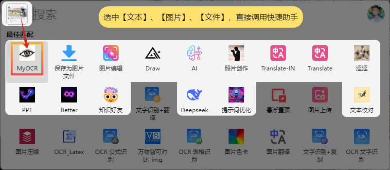

## Anywhere使用教程

### 设置页面

#### 提供商设置

提供商设置分为两个部分，默认提供商设置和其他提供商设置。

- 默认提供商设置是用户使用Anywhere时，如果提示词没有设置模型，则使用默认提供商选择的模型。填入`base_url`和`api_key`（注意`base_url`以`/v1`结尾，如以下截图）后点击`Get Models`后能够自动获取模型，下拉选择使用的默认模型。在`Default Custom`输入框中输入模型名称，点击Add后会在模型列表中添加自定义模型（如输入"gpt"，会添加自定义模型"gpt(Custom)"），点击`Delete`后删除自定义模型（删除时只需要输入模型名，不需要添加“(Custom)”后缀）
  - 
- 添加其他提供商，有助于使用任何其他Openai格式的Api（google提供Openai格式的api，填入`"https://generativelanguage.googleapis.com/v1beta`即可，但是目前不支持自动获取模型，可以自定义输入模型名称使用），使用方法和默认提供商设置相同，但是模型列表不必再提供商中选择，在prompts中选择对应提供商的模型就好
  - 

### 使用设置

目前提供以下使用设置：

- `Stream`: 是否使用流式输出，如果选择`True`，则进行流式请求,使用流式输出。（*如果使用非流式请求，则不会使用流式请求，AI回复完成后内容才会展现，在prompt的`Show Mode`中如果选择`input`，仍旧会在用户当前输入框条用Utools的api以流式展示，但本质上是非流式请求*）
- `Skip LineBreak`：选择的文本是否自动删除换行符，如果选择`True`，则自动删除换行符，如果选择`False`，则保留换行符。在OCR或翻译等功能中可能需要保证用户的划选的多行内容自动删去换行符后发送给AI
- `Auto CloseOnBlur`：*在prompt的`Show Mode`中选择`window`后有效。* 如果选择`True`，则当用户点击窗口外的其他地方时，自动关闭窗口，如果选择`False`，则不会自动关闭窗口，实现即用即开，用完即走
- `Ctrl+Enter to Send`：*在prompt的`Show Mode`中选择`window`后有效。* 开启的提问页面中，按下`Ctrl+Enter`键发送问题，如果选择`False`，则按下`Enter`键发送问题
- `Success Notification`：如果选择`True`，则当AI回复完成后，会弹出通知，如果选择`False`，则不会弹出通知（*在prompt的`Show Mode`中选择`window`后，只有初次请求会触发成功提示，追问不再出现成功提示*）

### 提示词设置
用于多种功能定义，利用AI实现多种工具，如OCR、翻译、代码解释、变量命名等。

设置中包含两个按钮+五列设置
- `Add Prompt`：位于底部左侧，点击后添加一行空白提示词行
- `Save Prompt`：位于底部右侧，点击后保存所有Prompts设置，注意修改任意提示词后点击保存，否则修改不会生效
- `Key`：提示词名称，用于在prompt中调用，如`OCR`、`Translate`等，设置的`Key`将会生成Utools匹配指令，可以在Utools的快捷设置中设置全局快捷键便于调用
  

- `Type`：调用方法，目前支持`general`、`text`和`image`
  
  - `general`：选择文本或者截图后，呼出utools菜单可以选择`Key`来调用工具
  - `text`：选择文本后，呼出utools菜单可以选择`Key`来调用工具，并自动将选择的文本作为输入发送给AI
  - `image`：选择截图后，呼出utools菜单可以选择`Key`来调用工具，并自动将选择的截图作为输入发送给AI
- `Show Mode`：选择工具的展示模式，目前支持`input`和`window`
  - `input`：工具的输出结果会直接显示在当前输入框中，从而实现AI便捷输入（请确保调用该功能时有聚焦输入框）
  - `window`：工具的输出结果会以窗口形式展示
- `Prompt`：设置AI的系统提示词，AI将遵守提示词要求进行回复
- `Model`：设置执行该提示词的AI模型，默认为Default，即默认提供商设置中选择的默认模型
- `Action`：删除按钮，点击后删除该条提示词设置

**修改Prompt后一定要点击`Save Prompt`！**

**修改Prompt后一定要点击`Save Prompt`！！**

**修改Prompt后一定要点击`Save Prompt`！！**

## 工具使用

### input模式

用户选择文字/截图后，调用`Show Mode`为`input`的提示词`Key`，工具的输出结果会直接显示在当前输入框中，从而实现AI便捷输入（请确保调用该功能时有聚焦输入框）

### window模式

用户选择文字/截图后，调用`Show Mode`为`window`的提示词`Key`，工具的输出结果会以窗口形式展示，如下图所示，其中标注处功能如下：
1. 调整窗口大小后，点击①处logo，窗口会更新为当前尺寸，下次调用该工具时，窗口会自动调整为保存的大小
2. 点击②处模型的名称，会出现下拉框，可以选择其他模型进行会回答
3. 对应设置中的`Auto CloseOnBlur`。点击③处按钮，窗口会“固定/取消固定”，取消固定后窗口失焦会自动消失
4. 点击④处按钮，自动复制当前展示的内容
5. 点击⑤处按钮，会对当前展示的内容进入编辑模式/markdown渲染模式（编辑更改 **不会** 修改AI对话历史）
6. 点击⑥处按钮，会清空当前窗口的所有对话历史
7. 点击⑦处按钮，重新发送上一条问题/取消当前发送
8. 点击⑧处按钮，发送问题

