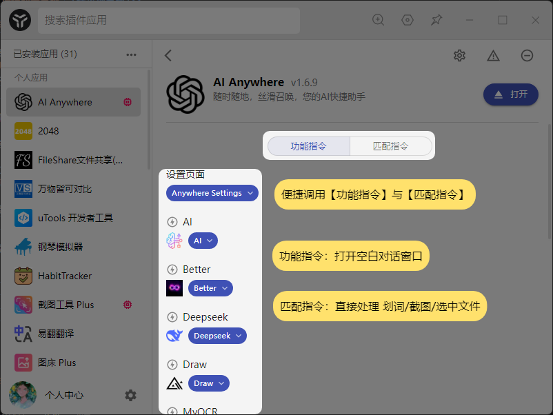

# Anywhere 使用教程

欢迎来到 Anywhere 的使用教程！本指南将详细介绍如何配置和使用 Anywhere，帮助您充分利用它的强大功能。

---

## ⚙️ 设置页面概览

Anywhere 的核心配置都集中在设置页面。您可以在这里管理AI服务服务商、调整通用设置以及自定义提示词。

### 1. 服务商设置

这里是您连接AI模型的入口。

*   **添加服务服务商**：
    *   点击 `Add Provider` 按钮，您可以添加新的AI服务服务商。Anywhere 支持与 OpenAI API 兼容的各种服务。
    *   填写 `API KEY` 和 `API URL`。
    *   点击 `Get Models`，Anywhere 将从该服务商获取可用的模型列表。您可以从中选择并添加到您的模型列表中。
*   **添加自定义模型**：
    *   点击 `Add Model` 按钮，您可以手动设置一个自定义模型名称。
*   **多密钥轮询**：
    *   在 `API KEY` 字段中，您可以通过使用**英文逗号**分隔的方式，同时填入多个API密钥。Anywhere 将自动轮询这些密钥以确保服务的可用性。

*图示：服务商设置界面，显示添加服务商、API配置及模型选择。*

---

### 2. 通用设置

这些设置将影响 Anywhere 的整体操作行为，您可以根据个人习惯进行调整。

*图示：通用设置界面，展示各项功能开关及数据管理、窗口尺寸设置。*

*   **语言**：
    *   选择 Anywhere 应用界面的显示语言。
*   **流式响应 (Stream)**：
    *   若启用（开），AI的回复将以流式（即文字逐个显示）方式展现，提供更流畅的交互体验。
    *   若禁用（关），AI回复会在全部生成完成后一次性显示。
    *   *即使此项禁用，若在提示词的 `Show Mode` 中选择 `input`，Anywhere 仍会通过 Utools API 以流式效果将内容输入到当前文本框，但本质上仍是非流式请求。*
*   **深色模式 (独立窗口)**：
    *   若启用（开），独立的AI响应窗口将使用深色模式主题。
*   **失焦时自动关闭窗口 (Auto CloseOnBlur)**：
    *   *此功能主要在提示词的 `Show Mode` 选择 `window` 时有效。*
    *   若启用（开），当独立的AI响应窗口失去焦点（即您点击窗口以外的任何区域）时，该窗口将自动关闭，实现“即用即走”的效果。
    *   若禁用（关），窗口将保持打开状态，直到您手动关闭。
*   **发送时跳过换行符 (Skip LineBreak)**：
    *   若启用（开），当您划选多行文本作为输入时，Anywhere 会自动删除文本中的换行符再发送给AI。这在 OCR 或翻译等多行内容需要连接起来的场景中非常有用。
    *   若禁用（关），则保留文本中的所有换行符。
*   **Ctrl+Enter 发送 (Ctrl+Enter to Send)**：
    *   *此功能主要在提示词的 `Show Mode` 选择 `window` 时有效。*
    *   若启用（开），在窗口模式下，您需要按下 `Ctrl+Enter` 键来发送问题。
    *   若禁用（关），只需按下 `Enter` 键即可发送问题。
*   **显示成功通知 (Success Notification)**：
    *   若启用（开），当AI回复完成后，系统会弹出通知提示。
    *   若禁用（关），则不会弹出通知。
    *   *在 `window` 模式下，只有首次请求会触发成功通知，后续追问不再显示。*
*   **固定窗口位置**：
    *   若启用（开），您可以固定对话窗口在屏幕上出现的默认位置。您可以在窗口模式下，点击模型名称左侧图标来更新此位置。
*   **数据管理**
    *   **导出配置**：将当前所有设置导出为 JSON 文件。**请注意，配置文件包含敏感信息（如API密钥），切勿随意分享！**
    *   **导入配置**：从 JSON 文件导入设置。这将覆盖您当前的Anywhere设置。
*   **窗口尺寸**
    *   **窗口宽度 (px)**：设置独立响应窗口的默认宽度（以像素为单位）。默认值：532。
    *   **窗口高度 (px)**：设置独立响应窗口的默认高度（以像素为单位）。默认值：575。
    *   *您也可以在窗口模式下，点击模型名称左侧图标来更新当前默认的窗口尺寸。*

---

### 3. 提示词设置

提示词是 Anywhere 实现各种智能工具的核心。您可以自定义不同的提示词来完成 OCR、翻译、代码解释、变量命名等多种功能。

*图示：提示词设置界面，显示添加提示词、设置Key、Type、Show Mode、Prompt和Model选项。*

*   **`Add Prompt` (添加提示词)**：位于底部左侧，点击即可新建一个提示词。
*   **`Key` (提示词名称)**：
    *   这是您自定义的提示词的名称，用于在 Utools 菜单中调用。例如，您可以设置为 `OCR`、`Translate` 等。
    *   您设置的 `Key` 将自动生成对应的 Utools 匹配指令。您可以在 Utools 的快捷设置中为这些指令设置全局快捷键，以便更便捷地调用。
    
    *图示：Utools快捷键设置示例，展示如何为Anywhere的提示词Key设置快捷键。*
*   **`Type` (调用类型)**：定义该提示词的触发方式。
    *   `general`：当您框选文本或截图后，呼出 Utools 菜单，即可选择此 `Key` 来调用功能。Anywhere 会将选中文本或图片作为输入。
    *   `text`：**仅在选择文本后**，呼出 Utools 菜单，选择此 `Key`。Anywhere 会自动将您选择的文本作为输入发送给AI。
    *   `image`：**仅在选择截图后**，呼出 Utools 菜单，选择此 `Key`。Anywhere 会自动将您选择的截图作为输入发送给AI。
    
    *图示：提示词Type选择菜单，展示`general`、`text`、`image`选项。*
*   **`Show Mode` (展示模式)**：定义AI回复结果的显示方式。
    *   `input`：AI的输出结果会直接显示在您当前聚焦的输入框中。这使得AI能够直接协助您进行文本输入或内容补全。
        *   *请确保在调用此功能时，您的光标正聚焦在一个可编辑的输入框中。*
    *   `window`：AI的输出结果将以一个独立的窗口形式展示。此模式支持多轮对话追问。
*   **`Prompt` (系统提示词)**：您可以在此处设置AI的系统提示词。AI将根据您设定的提示词要求进行回复，例如限定角色、语气或回答格式。
*   **`Model` (AI模型)**：设置执行该提示词所使用的具体AI模型。默认为 `Default`，即服务商设置中您勾选的默认模型。

---

## 🛠️ 工具使用模式

Anywhere 提供了两种主要的工具使用模式，以适应不同的工作流程。

### 1. Input 模式

在这种模式下，AI的回复将直接“输入”到您当前活跃的文本编辑区域。

*   **操作流程**：
    1.  选中您需要处理的文字或复制图片。
    2.  将光标移动到您希望AI回复内容出现的目标输入框（例如：浏览器搜索栏、笔记应用、代码编辑器等），并确保该输入框处于聚焦状态。
    3.  调用 `Show Mode` 设置为 `input` 的提示词 `Key` （通过 Utools 快捷键或菜单）。
*   **效果**：AI的输出结果会直接模拟键盘输入，显示在您当前聚焦的输入框中。

*图示：Input模式下AI回复直接键入到当前输入框中。*

### 2. Window 模式

这种模式下，AI的回复会显示在一个独立的对话窗口中，支持更复杂的交互。

*   **操作流程**：
    1.  选中您需要处理的文字或截图。
    2.  调用 `Show Mode` 设置为 `window` 的提示词 `Key`。
    3.  Anywhere 将弹出一个独立的对话窗口，显示AI的回复。
*   **多轮追问**：
    *   在弹出的窗口中，您可以直接输入文字进行追问，或粘贴图片、拖拽文件上传（需模型支持）。
    *   根据“通用设置”中的 `Ctrl+Enter 发送` 选项，按下 `Ctrl+Enter` 或 `Enter` 键发送问题。
*   **窗口管理**：
    *   窗口大小和位置：您可以点击模型名称左侧的图标来更新当前默认的窗口大小和位置。
    *   智能关闭：根据“通用设置”中的 `失焦时自动关闭窗口` 选项，窗口可以在失去焦点后自动关闭。在窗口右上角，您也可以单独为当前窗口设置此项。

*图示：Window模式下的独立的对话窗口，展示多轮对话和窗口操作。*

---

## ⚠️ 常见问题与注意事项

1.  **虚拟机兼容性**：Anywhere 依赖 Utools 内置的 API 实现模拟输入功能。在虚拟机环境中使用时，可能会出现兼容性问题，甚至导致文本重复，因此**不建议在虚拟机中运行**。
2.  **Markdown 输出冲突**：AI 默认回复通常遵循 Markdown 格式。然而，多数 Markdown 编辑器会自动补全用户输入格式（例如，在列表末尾换行时自动增加序号），这可能与 AI 的 Markdown 回复产生冲突。当您选择 `input` 输出模式时，如果遇到此类问题，建议切换到 Markdown 编辑器的**源码模式**进行输入。
3.  **独立窗口与设置**：当您在设置中开启“自动分离为独立窗口”功能时，在文本生成过程中，设置界面可能无法关闭，请注意此行为。
4.  **文件上传报错**：请确保您上传的文件类型受当前所选的AI模型支持。如果模型不支持该文件类型，Anywhere 将会报错。