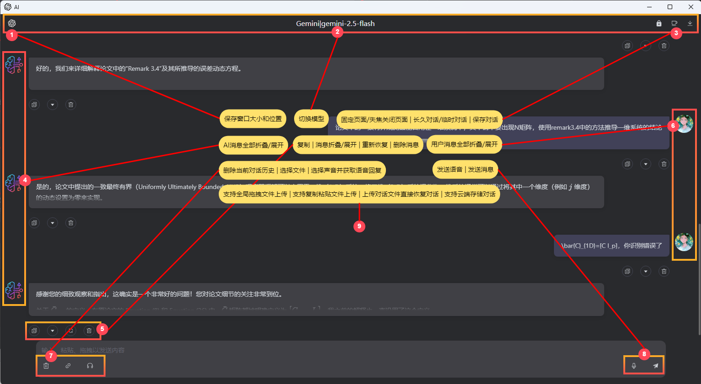

# Anywhere 详细使用教程

欢迎使用 Anywhere！本教程将引导您从初次设置到熟练使用各项高级功能，充分发挥其作为您的智能AI助手的潜力。

## 目录

1.  [首次配置：连接到 AI 服务](#1-首次配置连接到-ai-服务)
2.  [核心概念解析](#2-核心概念解析)
    *   [快捷助手 (Prompts)](#快捷助手-prompts)
    *   [服务商 (Providers)](#服务商-providers)
    *   [云端对话 (Chats)](#云端对话-chats)
3.  [功能详解与配置指南](#3-功能详解与配置指南)
    *   [快捷助手页面](#31-快捷助手页面)
    *   [服务商页面](#32-服务商页面)
    *   [设置页面](#33-设置页面)
4.  [对话窗口使用指南](#4-对话窗口使用指南)
    *   [文本与文件交互](#文本与文件交互)
    *   [语音交互：输入与输出](#语音交互输入与输出)
    *   [消息管理](#消息管理)
    *   [窗口控制](#窗口控制)
5.  [高级技巧与附录](#5-高级技巧与附录)
    *   [使用搜索模型](#使用搜索模型)
    *   [语音角色参考列表](#语音角色参考列表)

---

## 1. 首次配置：连接到 AI 服务

要使用 Anywhere，您首先需要一个 AI 服务商提供的 API 密钥。以下以 **OpenAI** 为例进行说明：

1.  **获取API密钥**：访问 [https://platform.openai.com/api-keys](https://platform.openai.com/api-keys) 创建并复制您的 API 密钥。
2.  **进入服务商页面**：在 Anywhere 主界面，点击右上角的 **云朵图标** (☁️)，进入“服务商”页面。
3.  **配置服务商**：
    *   页面上会有一个默认的 `default` 服务商。点击它。
    *   在 **API 密钥** 字段中，粘贴您刚刚复制的密钥。
    *   在 **API URL** 字段中，确保地址为 `https://api.openai.com/v1`。
    *   点击 **“从 API 获取模型”** 按钮，Anywhere 会自动拉取您账户可用的模型列表。
    *   或者，您也可以点击 **“手动添加”** 来添加模型，例如 `gpt-4o-mini`。

> **提示**：您可以按照 `README.md` 中的“快速上手”部分，配置如 Google AI Studio、OpenRouter 等其他服务商，步骤类似。

---

## 2. 核心概念解析

### 快捷助手 (Prompts)

快捷助手是 Anywhere 的核心。每一个快捷助手都是一个**预设的、可被快速调用**的 AI 任务。例如，您可以创建一个“代码优化”助手、一个“英语翻译”助手或一个“周报生成”助手。

### 服务商 (Providers)

服务商是提供 AI 模型能力的后端服务，如 OpenAI、Google、OpenRouter、Pollinations 等。您可以在此页面管理不同服务商的 API 密钥、URL 和可用模型。

### 云端对话 (Chats)

这是一个通过 **WebDAV** 实现的对话历史云同步功能。配置好后，您可以将重要的对话保存到自己的云存储（如 坚果云、Koofr 等），实现跨设备查看和恢复。

---

## 3. 功能详解与配置指南

### 3.1 云端对话管理页面

云端对话管理可以帮助用户将聊天历史保存在云端并便捷管理。

*图示：云端对话管理页面，可以管理保存到云端的会话

点击主界面顶部的 **对话气泡图标** (💬) 即可进入此页面。

**核心功能**：管理所有通过 WebDAV 保存的云端对话记录。

#### 前置条件

要使用此功能，您必须首先在 **“设置”** 页面（齿轮图标 ⚙️）完成 WebDAV 的配置。请确保正确填写以下两个关键字段：
*   **WebDAV URL**：您的 WebDAV 服务器地址。
*   **WebDAV 数据路径 (Data Path)**：用于存放对话记录的文件夹路径，默认为 `/anywhere_data`。

如果未配置，此页面将提示您前往设置。

#### 界面与操作

*   **对话列表**：以表格形式展示您保存在 WebDAV 服务器上的所有对话文件。包含对话名称、修改时间和文件大小。
*   **操作按钮**：
    *   **聊天**：点击后将加载该对话记录，并打开一个新的独立对话窗口，让您可以无缝地继续之前的对话。
    *   **重命名**：修改云端保存的对话文件名。
    *   **删除**：从您的 WebDAV 服务器上永久删除该对话记录。
*   **底部工具栏**：
    *   **刷新**：从服务器重新获取最新的对话列表。
    *   **删除选中**：勾选多条对话记录后，进行批量删除。
    *   **分页导航**：当对话记录过多时，方便您进行翻页浏览。

### 3.2 快捷助手页面

提示词是 Anywhere 实现各种智能工具的核心。可以自定义不同的提示词来完成 OCR、翻译、代码解释、变量命名、文件总结等多种功能。

*图示：提示词设置界面，可以设置`新增快捷助手`、默认配置即有良好对话效果，希望追求定制化体验可以查看以下详细参数*

点击 **火箭图标** (🚀) 进入此页面。这里您可以创建、管理和组织您所有的快捷助手。

#### 创建与编辑快捷助手

1.  **新增助手**：点击底部的“新增快捷助手”按钮。
2.  **配置参数**：
    *   **快捷助手名称**：该助手的唯一标识，也是您在 uTools 中呼出它的关键词。
    *   **图标**：为您的助手设置一个喜欢的图标。
    *   **类型**：
        *   `通用`: 响应文本、截图和文件。
        *   `文本`: 仅响应文本。
        *   `截图`: 仅响应截图。
        *   `文件`: 仅响应文件。
    *   **显示模式**：
        *   `输入框`: AI 的回复将直接输入到您当前光标所在的输入框。
        *   `剪贴板`: AI 的回复将自动复制到剪贴板。
        *   `独立窗口`: 弹出独立的对话窗口，支持多轮对话（**推荐**）。
    *   **模型**：选择一个已配置好的服务商和模型。
    *   **默认声音**：默认关闭，选择一个声音角色，当模型支持语音输出时，AI将以此声音进行回复。
    *   **快捷助手内容**：核心的系统提示词（System Prompt），告诉 AI 它应该扮演什么角色、执行什么动作、遵循什么规则。
    *   **快捷助手参数**：
        *   `文本/截图直接发送`：开启后，划词或截图后将直接请求AI并在“独立窗口”输出结果。
        *   `文件直接发送`：同上，但针对文件。
        *   `补充文本信息`：为兼容某些服务商，在没有文本输入时自动添加时间戳。
    *   **模型参数**：
        *   `流式响应`：让AI逐字或逐句返回内容，体验更流畅。
        *   `自定义温度`：调整AI回复的创造性，值越高越随机。

#### 管理快捷助手

*   **标签**：您可以创建标签（如“工作”、“编程”、“娱乐”）来对助手进行分类管理。
*   **排序**：在标签内，可以通过左右箭头按钮调整助手的顺序。
*   **启用**：点击标签右侧按钮一键启用对应快捷助手。

### 3.3 服务商页面

服务商页面是连接AI模型的入口。

*图示：服务商设置界面，显示添加服务商、API配置及模型选择。*

点击 **云朵图标** (☁️) 进入此页面。

*   **添加/删除服务商**：通过左侧列表下方的“添加服务商”按钮创建新的配置。点击列表中的服务商，然后在右侧点击垃圾桶图标可删除。
*   **排序**：通过服务商名称右侧的上下箭头按钮，调整服务商在模型选择列表中的优先级。
*   **管理模型**：
    *   **从API获取模型**：自动刷新并显示该服务商下所有可用的模型。
    *   **手动添加**：当API无法获取或需要添加特殊模型（如带 `:search` 后缀的搜索模型）时使用。

### 3.4 设置页面

这些设置将影响 Anywhere 的整体操作行为，可以根据个人习惯进行调整。

*图示：通用设置界面，展示各项功能开关及数据管理、窗口尺寸设置。*

点击 **齿轮图标** (⚙️) 进入此页面。新的卡片式设计让配置更直观。

#### 通用设置

*   **语言**：切换插件的界面语言。
*   **主题**：选择全局的 **浅色** 或 **暗色** 主题。
*   **流式响应**：全局开关，可被快捷助手内的设置覆盖。
*   **失焦时自动关闭窗口**：开启后，独立对话窗口在失去焦点时会自动关闭。
*   **始终在最上层**：让对话窗口保持在所有其他窗口之上。
*   **`Ctrl+Enter` 发送**：切换 `Enter` 和 `Ctrl+Enter` 的发送/换行功能。
*   **其他开关**：如“跳过换行符”、“显示成功通知”、“固定窗口位置”等，根据描述按需开启。

#### 语音设置

*   **管理声音角色**：这里列出了所有可用于语音输出的声音。
*   **添加声音**：点击“添加声音”按钮，输入声音的ID（如 `alloy-女声`，`alloy`是ID，`女生`是自定义描述）。
*   **编辑/删除**：点击已有的声音标签可以修改其名称（如添加描述：`alloy-女声`），点击标签可以编辑，点击标签上的 `x` 可删除。
    > 这个列表中的声音，将出现在“快捷助手编辑页面”的“默认声音”下拉菜单中。

#### 数据管理与 WebDAV

*   **本地导入/导出**：将您的所有配置（包括快捷助手和服务商）保存到本地JSON文件，或从文件中恢复。
*   **WebDAV 配置**：
    1.  填入您的 WebDAV 服务器地址、用户名和密码。
    2.  `配置路径`：用于存放插件**配置**的备份文件。默认为 `/anywhere`。
    3.  `数据路径`：用于存放**云端对话**记录的 `json` 文件。默认为 `/anywhere_data`。
    4.  配置完成后，即可使用“备份到WebDAV”和“管理备份”功能。

#### 窗口尺寸

*   在此处可以精确设置独立对话窗口的默认宽度和高度。

---

## 5. 工具使用模式

Anywhere 提供了三种主要的工具使用模式，以适应不同的工作流程。

### 1/2. 输入框模式（剪切板模式类似）

*图示：输入框模式下AI回复直接键入到当前输入框中。*

在这种模式下，AI的回复将直接“输入”到当前活跃的文本编辑区域。

* **操作流程**：
  1. 选中需要处理的文字或复制图片。
  2. 将光标移动到希望AI回复内容出现的目标输入框（例如：浏览器搜索栏、笔记应用、代码编辑器等），并确保该输入框处于聚焦状态。
  3. 调用 `显示模式` 设置为 `输入框` 的快捷助手 （通过 Utools 快捷键或菜单）。
* **效果**：AI的输出结果会直接模拟键盘输入，显示在当前聚焦的输入框中。
* **剪切板模式**：与输入框模式类似，区别在于快捷助手设置为 `剪切板` 模式，AI的回复会自动复制到剪贴板，需要手动粘贴到目标输入框。

### 3. 独立窗口模式

*图示：独立窗口模式下的独立的对话窗口，展示多轮对话和窗口操作。*

这种模式下，AI的回复会显示在一个独立的对话窗口中，支持更复杂的交互。

* **操作流程**：
  1. 选中需要处理的文字或截图。
  2. 调用 `显示模式` 设置为 `独立窗口` 的提示词 `Key`。
  3. Anywhere 将弹出一个独立的对话窗口，显示AI的回复。
* **多轮追问**：
  * 在弹出的窗口中，可以直接输入文字进行追问，或粘贴图片、拖拽文件上传（需模型支持）。
  * 根据“通用设置”中的 `Ctrl+Enter 发送` 选项，按下 `Ctrl+Enter` 或 `Enter` 键发送问题。
* **语音输入/输出**：
  * **语音输入**：点击`麦克风按钮`，开始录音，录音结束后点击`对勾图标`发送，或点击`叉号图标`取消。
  * **语音输出**：点击`耳机按钮`，选择`声音角色`，AI将使用指定声音进行回复。
* **窗口管理**：
  * 窗口大小和位置：可以点击模型名称左侧的图标来更新当前默认的窗口大小和位置。
  * 智能关闭：根据“通用设置”中的 `失焦时自动关闭窗口` 选项，窗口可以在失去焦点后自动关闭。在窗口右上角，也可以单独为当前窗口设置此项。
* **对话保存与加载**：
  * 点击右上角对话保存按钮，可以将当前对话保存为 JSON 文件、 Markdown 文件和保存到云端。
    * 选中保存的 JSON 文件，调用“恢复聊天”功能，继续之前的对话。在任一窗口模式上传保存的对话记录，都能够将当前窗口恢复为对话记录中的状态。
    * 保存到云端：当且仅当进行 WebDAV 配置时，保存到云端功能才可用。云端保存的对话记录可以跨设备同步，并且可以随时恢复。
    * Markdown 文件：保存为 Markdown 文件，方便分享或进一步编辑。
    
  * 继续对话将不会更改已保存的对话记录，注意保存新的对话记录防止数据丢失。

---

## 5. 对话窗口使用指南

### 文本与文件交互

*   **发送消息**：在底部的输入框输入文本，按 `Enter` 或 `Ctrl+Enter` 发送。
*   **多文件上传**：
    *   **拖拽**：直接将多个文件拖入窗口。
    *   **粘贴**：复制文件后，在窗口内按 `Ctrl+V`。
    *   **上传**：点击回形针图标 (📎) 选择文件。
*   **附件展示**：已添加的文件会以卡片形式显示在输入框上方，可以单独移除。

### 语音交互（输入与输出）

*   **语音输入**：
    1.  确保当前快捷助手选择的模型支持音频输入（如 `gpt-4o-audio-preview`, `gemini-2.5-flash-preview-tts`,`openai-audio`）。
    2.  点击输入框右侧的 **麦克风图标** (🎤)，开始录音。
    3.  录音时，输入框会被波形图替代。
    4.  点击 **对勾图标** (✔️) 结束并发送语音，或点击 **叉号图标** (❌) 取消。
*   **语音输出**：
    1.  确保快捷助手配置了**声音角色**，且模型支持语音输出。
    2.  AI将回复语音，语音内容也将被展示。
    3.  在AI的回复气泡会包含一个音频播放器，您可以暂停、播放或拖动进度条。

### 消息管理

*   **复制/重试/删除**：鼠标悬停在消息气泡上，会出现相应的操作按钮。
*   **折叠/展开**：
    *   点击消息气泡上的 **V字符号** 图标可以折叠/展开单条消息。
    *   点击**用户或AI的头像**，可以批量折叠/展开该角色的所有消息。
*   **查看系统提示词**：对话顶部的灰色条幅显示了当前快捷助手的系统提示词，点击可查看全文。

### 窗口控制

*   **固定页面/失焦关闭**：点击窗口左上角的 **圆形/锁型图标** (⭕/🔒)。
*   **记忆模式切换**：点击 **咖啡杯/棒棒糖图标** (☕/🍭)。咖啡杯代表记忆模式，保留完整上下文；棒棒糖代表无记忆模式，每次只发送当前内容和系统提示词。
*   **保存会话**：点击 **下载图标** (💾)，可以选择保存到云端（需配置WebDAV）、本地JSON文件（可恢复）或Markdown文件（易于阅读和分享）。

---

## 6. 高级技巧与附录

### 使用搜索模型（仅对于`https://gemini-oai.001412.xyz/v1`及相同项目部署的`API URL`）

部分模型支持网页搜索功能，通常需要在模型名称后添加特定后缀。例如，对于Gemini：
1.  在“服务商”页面，为您的Gemini服务商**手动添加**一个新模型。
2.  模型名称填写为 `gemini-1.5-flash:search`。
3.  在快捷助手中使用这个新模型，提问时AI即可联网搜索。

### 语音角色参考列表

> 在“设置 -> 语音设置”中添加以下ID，并可自定义描述，方便在快捷助手中选用。

1.  **OpenAI**：
    *   `alloy` (女声)
    *   `echo` (男声，清晰)
    *   `nova` (女声，清晰)
    *   `sage` (女声，年轻)
    *   `shimmer` (女声，明亮)
    *   `fable` (中性声)
    *   `coral` (女声，客服)
    *   `ash` (男声，商业)
    *   `ballad` (男声，故事)
    *   `verse` (男声，诗歌)
    *   `onyx` (男声，新闻)
2.  **Gemini**：
    *   `Zephyr` (女声，娇柔)
    *   `Puck` (男声，学生)
    *   `Charon` (男声，宽厚)
    *   `Kore` (女声，外向)
    *   `Fenrir` (男声，广播)
    *   `Leda` (女声，娇小)
    *   `Orus` (男声，开朗)
    *   `Aoede` (女声，客服)

---

教程到此结束。尽情探索 Anywhere 带来的便捷与强大功能吧！